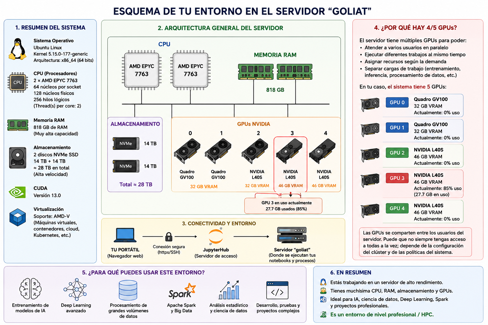

# Análisis del entorno JupyterHub — Servidor `goliat`

## Introducción

Estoy ejecutando notebooks dentro de un entorno JupyterHub universitario conectado a un servidor Linux remoto de altas prestaciones orientado a computación científica, inteligencia artificial y procesamiento de datos.

Los recursos del sistema indican que se trata de una infraestructura similar a la utilizada en:

- IA y Deep Learning
- HPC (High Performance Computing)
- entrenamiento de modelos
- computación distribuida
- laboratorios universitarios
- servidores enterprise
- cloud computing

---

# 1. Sistema Operativo

## Comando ejecutado

```bash
uname -a
```

## Resultado

```text
Linux goliat 5.15.0-177-generic #187-Ubuntu SMP Sat Apr 11 22:54:33 UTC 2026 x86_64 x86_64 x86_64 GNU/Linux
```

## Explicación

El servidor utiliza:

- Ubuntu Linux
- Kernel Linux 5.15
- Arquitectura x86_64 (64 bits)

Linux es el sistema operativo dominante en:

- servidores
- cloud computing
- IA
- clusters HPC
- Kubernetes
- Spark
- Data Engineering

La mayoría de sistemas de IA profesionales funcionan sobre Linux.

---

# 2. Nombre del servidor

## Comando

```bash
hostname
```

## Resultado

```text
goliat
```

## Explicación

`goliat` es el nombre del nodo o servidor físico/remoto al que estoy conectado.

El nombre probablemente hace referencia a un nodo potente del sistema universitario.

---

# 3. CPU (Procesadores)

## Comando

```bash
lscpu
```

## Información importante obtenida

```text
Model name: AMD EPYC 7763 64-Core Processor
CPU(s): 256
Socket(s): 2
Core(s) per socket: 64
Thread(s) per core: 2
```

---

# Explicación de la CPU

El servidor dispone de:

## 2 procesadores físicos AMD EPYC

Cada procesador tiene:

```text
64 núcleos físicos
```

Total:

```text
2 × 64 = 128 núcleos físicos
```

Además, cada núcleo puede manejar:

```text
2 hilos simultáneos
```

Por tanto:

```text
128 × 2 = 256 hilos lógicos
```

De ahí:

```text
CPU(s): 256
```

---

# ¿Qué significa esto?

Es un servidor extremadamente potente.

## Comparación

| Equipo | Núcleos típicos |
|---|---|
| Portátil normal | 4-16 |
| Workstation potente | 32-64 |
| Servidor `goliat` | 128 núcleos físicos |

---

# ¿Qué es AMD EPYC?

Los procesadores AMD EPYC están diseñados para:

- datacenters
- cloud
- virtualización
- IA
- HPC
- servidores enterprise

Son equivalentes a los Intel Xeon de alta gama.

---

# 4. Memoria RAM

## Comando

```bash
free -h
```

## Resultado

```text
Mem: 818Gi
```

---

# Explicación

El servidor tiene aproximadamente:

```text
818 GB de RAM
```

---

# Comparación de RAM

| Equipo | RAM típica |
|---|---|
| Portátil normal | 8-16 GB |
| Workstation potente | 64-128 GB |
| Servidor `goliat` | 818 GB |

---

# ¿Para qué sirve tanta RAM?

La RAM es fundamental para:

- cargar datasets enormes
- Spark
- entrenamiento de IA
- notebooks pesados
- procesamiento paralelo
- caching
- Data Engineering

Ejemplos:

- trabajar con millones de filas en memoria
- entrenar modelos grandes
- paralelizar procesos
- ejecutar pipelines complejos

---

# 5. Almacenamiento

## Comando

```bash
df -h
```

## Información importante

```text
/dev/nvme1n1 14T
/dev/nvme2n1 14T
```

---

# Explicación

El servidor utiliza discos:

- NVMe SSD
- de 14 TB cada uno

Total aproximado:

```text
28 TB
```

---

# ¿Qué es NVMe?

NVMe es una tecnología de almacenamiento SSD ultrarrápida.

Es mucho más rápida que:

- HDD tradicionales
- SSD SATA normales

---

# ¿Por qué es importante?

La velocidad de almacenamiento es crítica para:

- IA
- lectura masiva de datos
- Spark
- datasets grandes
- entrenamiento de modelos
- pipelines ETL

---

# 6. GPUs NVIDIA

## Comando

```bash
nvidia-smi
```

---

# GPUs detectadas

## GPUs 0 y 1

```text
Quadro GV100
32 GB VRAM
```

---

# GPUs 2, 3 y 4

```text
NVIDIA L40S
46 GB VRAM
```

---

# Explicación

El servidor dispone de:

- 2 GPUs NVIDIA Quadro GV100
- 3 GPUs NVIDIA L40S

---

# ¿Qué es una GPU?

Una GPU es un procesador especializado en cálculo paralelo.

Las GPUs son esenciales en:

- Deep Learning
- IA generativa
- visión artificial
- entrenamiento de redes neuronales
- álgebra lineal masiva

---

# 7. NVIDIA Quadro GV100

Las Quadro GV100 son GPUs profesionales basadas en arquitectura Volta.

Características:

- 32 GB VRAM
- cálculo científico
- CUDA
- HPC
- Deep Learning

---

# 8. NVIDIA L40S

Las NVIDIA L40S son GPUs modernas de datacenter orientadas a:

- IA generativa
- LLMs
- inferencia
- entrenamiento
- datacenters
- computación acelerada

---

# Comparación rápida

| GPU | VRAM |
|---|---|
| RTX 3060 portátil | 6-8 GB |
| RTX 4090 | 24 GB |
| NVIDIA L40S | 46 GB |

---

# 9. VRAM

La VRAM es la memoria interna de la GPU.

---

# ¿Por qué es importante?

La VRAM determina:

- tamaño máximo de modelos
- batch sizes
- capacidad IA
- embeddings
- inferencia
- entrenamiento

---

# VRAM total aproximada del sistema

```text
(3 × 46 GB) + (2 × 32 GB)
≈ 202 GB VRAM
```

---

# 10. CUDA

## Resultado detectado

```text
CUDA Version: 13.0
```

---

# ¿Qué es CUDA?

CUDA es la tecnología de NVIDIA para usar GPUs como aceleradores de cálculo.

Gracias a CUDA se aceleran:

- PyTorch
- TensorFlow
- JAX
- RAPIDS
- modelos IA
- operaciones matriciales

---

# 11. GPU actualmente en uso

## Resultado observado

```text
GPU 3 NVIDIA L40S
27753MiB usados
85% utilización
```

---

# Explicación

En ese momento otro usuario estaba utilizando intensamente la GPU.

Probablemente:

- entrenando un modelo
- ejecutando inferencia
- usando PyTorch
- utilizando TensorFlow
- ejecutando un notebook pesado

---

# 12. NUMA

## Resultado

```text
NUMA node(s): 2
```

---

# ¿Qué es NUMA?

NUMA (Non-Uniform Memory Access) es una arquitectura usada en servidores multiprocesador grandes.

Permite optimizar:

- acceso a memoria
- paralelismo
- rendimiento HPC

Esto es típico de infraestructura profesional.

---

# 13. Virtualización

## Resultado

```text
Virtualization: AMD-V
```

---

# ¿Qué significa?

El sistema soporta:

- máquinas virtuales
- cloud computing
- contenedores
- Kubernetes
- virtualización avanzada

---

# 14. Tipo de infraestructura

Por las características observadas:

- GPUs compartidas
- CPUs EPYC
- RAM enorme
- Ubuntu
- JupyterHub
- CUDA
- almacenamiento NVMe

probablemente se trate de:

## Un servidor HPC / IA universitario

o un pequeño clúster de computación avanzada.

---

# 15. Conceptos importantes aprendidos

Gracias a este entorno puedo aprender sobre:

## Infraestructura

- Linux
- servidores
- HPC
- GPUs
- CUDA
- virtualización

## IA

- PyTorch
- TensorFlow
- JAX
- entrenamiento GPU
- inferencia

## Data Engineering

- paralelización
- memoria
- procesamiento masivo
- Spark
- pipelines

## Sistemas

- monitorización
- recursos
- scheduling
- procesos

---

# 16. Relación con el mundo profesional

Este tipo de infraestructura es similar a la usada en:

- :contentReference[oaicite:0]{index=0}
- :contentReference[oaicite:1]{index=1}
- :contentReference[oaicite:2]{index=2}
- :contentReference[oaicite:3]{index=3}

La diferencia es que aquí el hardware es propiedad de la universidad.

---

# 17. Conclusión final

El entorno `goliat` no es simplemente un “ordenador para notebooks”.

Es una infraestructura profesional de computación avanzada con:

- CPUs enterprise AMD EPYC
- 818 GB de RAM
- GPUs NVIDIA de datacenter
- CUDA profesional
- almacenamiento NVMe masivo
- capacidades HPC

Este entorno es ideal para aprender:

- Inteligencia Artificial
- Deep Learning
- GPU Computing
- HPC
- Linux
- Data Engineering
- Infraestructura moderna
- Sistemas distribuidos
- Computación acelerada

