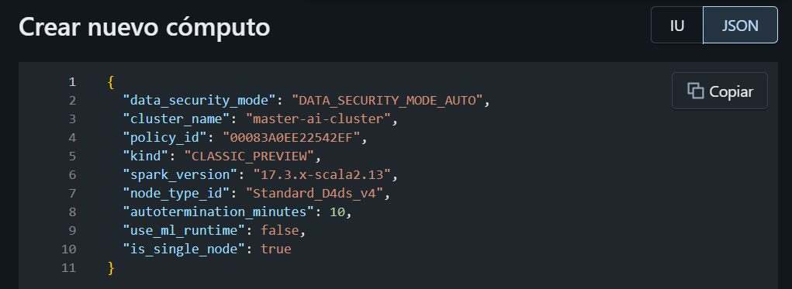

# Programming for AI PART I

Materials for Python, data structures, scientific computing, and engineering practices for AI projects.

# Programming for AI (PART II)
My repository notes for the second part of the 2026 edition of the Programming for AI course.

## Objectives 
Practical implementation in:
- Master Advanced Toolsets: High performance programming frameworks, especially JAX and Keras / TensorFlow
- **Understand low-level Abstractions**: Deconstruct how Neural Networks operate under the hood, from tensor operations to functional programming paradigms. 
- **Develop End to end Pipelines**: Learn to handle the full lifecycle of an AI model, from raw data ingestion.

- **Bridge Theory and code**: Translate mathematical concepts and algorithms into efficient vectorized code.

